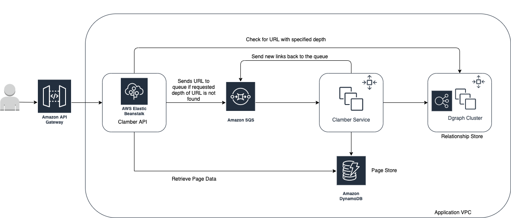

# clamber
[](https://travis-ci.org/stevenayers/clamber)
[](https://codecov.io/github/stevenayers/clamber?branch=master)
[](https://goreportcard.com/report/github.com/stevenayers/clamber)
[](https://github.com/stevenayers/clamber/releases/tag/v0.1-alpha)
[](https://godoc.org/github.com/stevenayers/clamber)

Fast & efficient web crawler providing an API which provides a means of bidirectional path finding.

Distributed version is in progress. Standalone version is [here](https://github.com/stevenayers/clamber/tree/standalone)

The infrastructure stack I have chosen to use is purely AWS because I wanted a project where I could apply all the technologies covered in the AWS DevOps Engineer Certification syllabus.

If I were to choose a stack based on what I believe to be the most appropriate, I would use the following:
- AWS/Azure/GCP
- Apache Kafka
- Dgraph
- Kubernetes (Preferably PaaS)
- EFK
- Prometheus, Alertmanager & Grafana
- Drop the Page Store and store the Page data in Dgraph.

## Software Design


## Infrastructure Design

Stay tuned...

## Endpoints

### Search
Takes a URL, depth, allow_external_links, checks Page Database to see if we already have the info. If we do, query and return it. If not, initiate recursive crawl.

`/search` will take the following query parameters:

| Parameter            | Type   | Stability           | Description |
|----------------------|--------|---------------------|-------------|
| url                  | string | Tested              | starting url for sitemap |
| depth                | int    | Tested              | -1 is infinite. If you specified 10, that would be your max depth to crawl. |
| display_depth        | int    | Experimental        | how deep a depth to return in JSON |
| allow_external_links | bool   | Not Yet Implemented | whether to crawl external links or not (Not yet implemented) |


Sample response:
```json
{
    "query": {
      "url": "https://example.com",
      "depth": 1, 
      "display_depth": 10,
      "allow_external_links": false
    },
    "status": {
      "message": "5 pages found at a depth of 1.",
      "code": "200"
    },
    "results": [
        {
            "URL": "https://example.com",
            "timestamp": "<time>",
            "links": [
                {
                    "URL": "https://example.com/about",
                    "timestamp": "<time>",
                    "links": []
                },
                {
                    "URL": "https://example.com/contact",
                    "timestamp": "<time>",
                    "links": []
                },
                {
                    "URL": "https://example.com/faq",
                    "timestamp": "<time>",
                    "links": []
                },
                {
                    "URL": "https://example.com/offices",
                    "timestamp": "<time>",
                    "links": []
                }
            ]
        }
    ]
}
```

url
depth
startUrl
parentUrl


