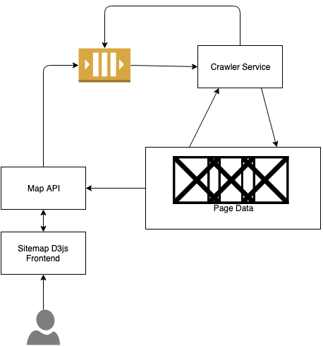

# go-clamber
A distributed system designed to crawl the internet, fronted by a d3js sitemap for visualisation.

Proposed tech stack:
- Golang
- gRPC
- Apache Kafka
- Apache Cassandra
- Google BigQuery
- D3js
- Kubernetes

This is an extension of: https://github.com/stevenayers/golang-webcrawler
## Design

### Goals
- Must be able to crawl internet infinitely, just domain based or on a fixed length
- Efficient Scaling
- Monitoring
- TDD will be used for development
- Will mitigate duplicate posts to the indexing service
- Must be able to cater to pages changing and updating the sitemap accordingly.
- All inter-service communication will be encrypted and will use gRPC

### Workflow



## Components
### Publishing Service
Publishing Service will take a REST API Request
```json
Option 1:
{
    "map_id": "db63e630-bea0-4517-ac44-bbd5ba335366",
    "url": "https://example.com"
}
Option 2:
{
    "map_id": "db63e630-bea0-4517-ac44-bbd5ba335366",
    "url": "https://example.com",
    "depth": 0
}
Option 3:
{
    "map_id": "db63e630-bea0-4517-ac44-bbd5ba335366",
    "url": "https://example.com",
    "depth": 0, 
    "allow_external_links": false
}
```
This will specify the starting URL. Maybe it would be a good idea to put a depth limit on this and option to search just the domain or all links. The sitemap service will use the map_id to identify which map to render. This would allow us to generate maps for the entire web, or just for singular sites.

map_id  (uuid) - Groups crawled website data into logical maps for visualization
depth (int) - 0 is infinite. If you specified 10, that would be your max depth to crawl. This would decrement on every crawl, and the child links of a page would be reposted back to the queue with the new decremented crawl depth.
allow_external_links (boolean) - Enables clamber to crawl outside of the website's domain.

Publishing service will convert this message into a protobuf and send it to kafka.

### Queue
We're going to use Kafka. This is a decision based on it's ability to scale well, and also just personal preference and a curiousity for the technology.
- Minimum 3 instance zookeeper quorom
- Parition Replication factor of 3
- Authentication
- TLS Encryption?

The Crawler service will both read and write URL messages to the queue.
### Crawler Service
Crawler service will ingest a URL protobuf message, fetch the page data, post page data and child links to the indexer, and push child links back into the queue to be crawled.

This will probably be an autoscaling worker pool on Kubernetes. It will also read and write to the queue.


#### Workflow
1. Consume URL
2. Check if URL exists in Crawler State Database and how long ago it was crawled. Potentially have a `"progress": "failure|in progress|success"` field?
3. If crawled within certain timeframe, stop crawling the page. If not or never been crawled, continue.
4. Request page - retry if failed.
5. Parse page and extract links and data
6. gRPC send to indexing service
7. gRPC send child URLs back to queue
8. If successful, write URL to crawler state database.

#### Trade Offs
Because we have such a large gap between checking crawler state and writing crawler state, we will have race conditions and generate duplicate page records.

If we locked the database here it would prevent race conditions, but to save a massive performance hit we would need to write straight after we read, and we couldn't know if the page request, parse, and data send ever succeeded.

Since we are locking, we're going to want to shard so we can lock per shard. We don't want to create unnecessary data, so we'll hash the URL and take the first few letters as the partition key.
- Hashes URL for partition key
- Queries db
- Locks shard
- Reads crawler state
- Updates if necessary
- Unlocks, then drops process or continues...
- Does all the things
- Updates progress with `failure` or `success`

### Crawler State Database
Cassandra seems to have good linear scaling. I also have used MongoDB and I'm not a fan. We have a strict schema here so we could go for RDBMS, but I think a distributed NoSQL database would respond better to how much this system will need to scale.

Database will store something like this (displaying it as JSON here just for my own readability):
```json
{
    "URL": "https://example.com",
    "timestamp": "1553949579",
    "progress": "failure|processing|success"
}
```


### Indexing Service
Indexing service will be a layer between the crawler service and our reporting database (BigQuery) which helps filter out duplicate data and manages writing to the database. We will also want to send receipt confirmation back to the crawler service.

### Index Database
BigQuery Database. We could use either redshift or bigquery here. We're going to use this to effectively store metadata on the entire internet, and we will want to be able to read this data as close to realtime as possible, so we can generate a the SiteMap UI and it's links on demand.

### Map API

Middle Layer between SiteMap UI, Index Database and Publishing Service. I wonder if you need a publishing service and Map API. Maybe publishing service is a bit pointless? Just merge the two and have a Map API.

Interesting problem here is how can you effectively use the data you already have from other maps to create a new map without recrawling?

1. Takes a URL, depth, allow_external_links, checks Index Database to see if we already have the info. If we do, query and return it.
2. If not, send the URL and info to the publishing service, which will forward it on to the queue.

### SiteMap UI

D3JS frontend which will show your main page, and all child pages visually. Once you click on a child link, it will query the database and retrieve that map.

We should also be able to display the data as a big overview map.

This frontend is where the User will enter the URL, depth and whether or not to search external pages.