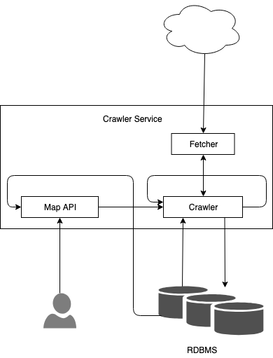

# Clamber
A distributed system designed to crawl the internet, fronted by a d3js sitemap for visualisation.

Proposed tech stack:
- Golang
- HTTP/REST
- JSON
- [Dgraph](https://dgraph.io)

This is an extension of: https://github.com/stevenayers/golang-webcrawler
## Design

### Goals
- Must be able to crawl internet infinitely, just domain based or on a fixed length
- TDD will be used for development
- Must be able to cater to pages changing and updating the sitemap accordingly.

### Workflow



## Components

### Map API
1. Takes a URL, depth, allow_external_links, checks Page Database to see if we already have the info. If we do, query and return it.
2. If not, initiate recursive crawl.

`/search` will take the following query parameters:
```json
{
    "url": "https://example.com",
    "depth": 0,
    "display_depth": 10,
    "allow_external_links": false
}
```
API will return
```json
{
  "query": {
      "url": "https://example.com",
      "depth": 1, 
      "display_depth": 10,
      "allow_external_links": false
  },
  "status": {
      "message": "5 pages found at a depth of 1.",
      "code": "200"
  },
  "results": [
        {
            "URL": "https://example.com",
            "timestamp": "<time>",
            "depth": 0,       
            "links": [
                "https://example.com/about",
                "https://example.com/contact",
                "https://example.com/faq",
                "https://example.com/offices"
            ],
            "body": null 
        },
        {
            "URL": "https://example.com/about",
            "depth": 1,
            "timestamp": "<time>",
            "links": [],
            "body": null
        },
        {
            "URL": "https://example.com/contact",
            "depth": 1,
            "timestamp": "<time>",
            "links": [],
            "body": null
        },
        {
            "URL": "https://example.com/faq",
            "depth": 1,
            "timestamp": "<time>",
            "links": [],
            "body": null
        },
        {
            "URL": "https://example.com/offices",
            "depth": 1,
            "timestamp": "<time>",
            "links": [],
            "body": null
        }
        
  ]
  
}
```
This will specify the starting URL. Maybe it would be a good idea to put a depth limit on this and option to search just the domain or all links. The sitemap service will use the map_id to identify which map to render. This would allow us to generate maps for the entire web, or just for singular sites.

depth (int) - 0 is infinite. If you specified 10, that would be your max depth to crawl. This would decrement on every crawl, and the child links of a page would be reposted back to the queue with the new decremented crawl depth.
allow_external_links (boolean) - Enables clamber to crawl outside of the website's domain.


#### Workflow
1. Check if URL exists
3. If url exists and data is not empty, stop process, if doesn't exist or timestamp is more than n seconds ago, continue.
4. Query page
5. Parse page
6. Update URL record with page field to database
7. Spawn new goroutine for child links


## Data Model

### Mutations
* Create single node with no predicates to existing nodes.
* Create singular node with a predicate to the parent node in that crawl sequence.
* Create predicate between two existing nodes
* Mutations will always be made with predicates facing upstream (eg. childPage -> parentPage)

### Queries
* Retrieve node by URL
* Retrieve node by Uid
* Recursive retrieval (reverse predicate calls)

### Questions
* What happens if the creation of a node fails?
* How do you manage predicates to a failed parent node?